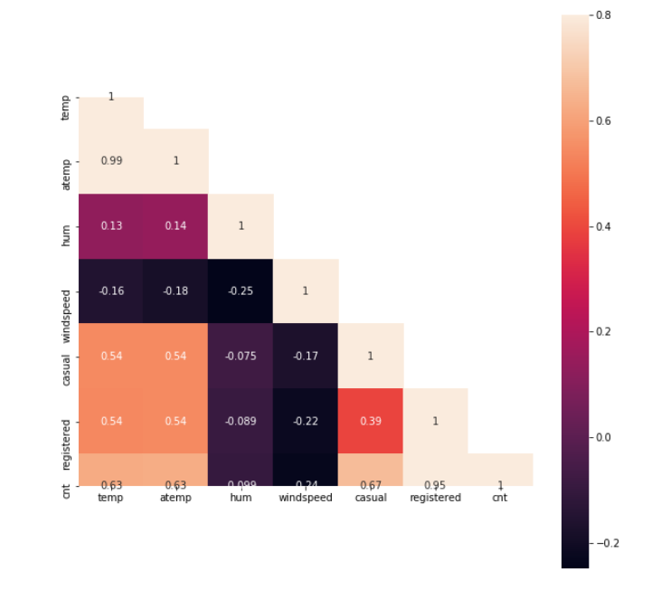
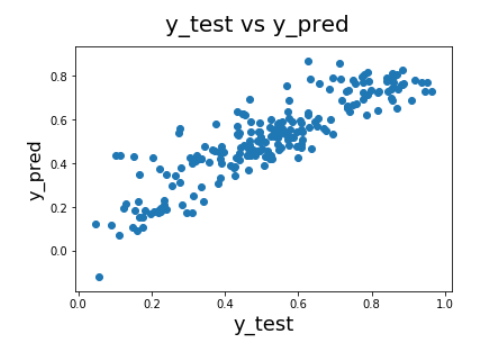
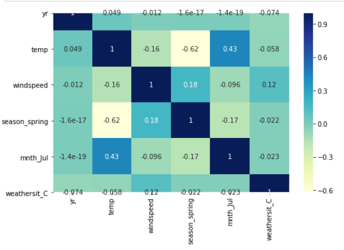

# 🚲 Bike-Sharing-Demand_ML

## 📌 Problem Statement

BoomBikes, a US-based bike-sharing company, experienced a decline in revenue during the COVID-19 pandemic.
The goal of this project is to analyze factors affecting bike demand and build a predictive model to estimate future demand.

---

## 🎯 Business Objective

* Identify key factors influencing bike demand
* Build a model to predict daily bike rentals
* Help the company optimize operations and improve revenue

---

## 📂 Dataset

The dataset contains daily bike rental information along with features such as:

* Weather conditions
* Season
* Temperature
* Year (trend factor)
* User type (casual vs registered)

Target Variable:
👉 **cnt (Total bike rentals)**

---

## 🔍 Approach

* Data Cleaning & Preprocessing
* Feature Engineering (handling categorical variables)
* Exploratory Data Analysis (EDA)
* Model Building (Regression)
* Model Evaluation

---

## 📊 Key Insights

* 📈 Bike demand increases significantly in **favorable weather conditions**
* 🌤 Temperature has a strong positive correlation with demand
* 📅 Demand increases year-over-year (growth trend)
* 🚫 Bad weather leads to sharp drops in rentals

---

## 📊 Visualizations

### 🔥 Correlation Heatmap

### 📈 Actual vs Predicted

### 📊 Feature Relationships

(Add your charts here)

---

## 🛠 Tools Used

* Python
* Pandas
* NumPy
* Matplotlib / Seaborn
* Scikit-learn

---

## 🎯 Outcome

The model successfully predicts bike demand and helps identify key drivers, enabling better planning and decision-making.
